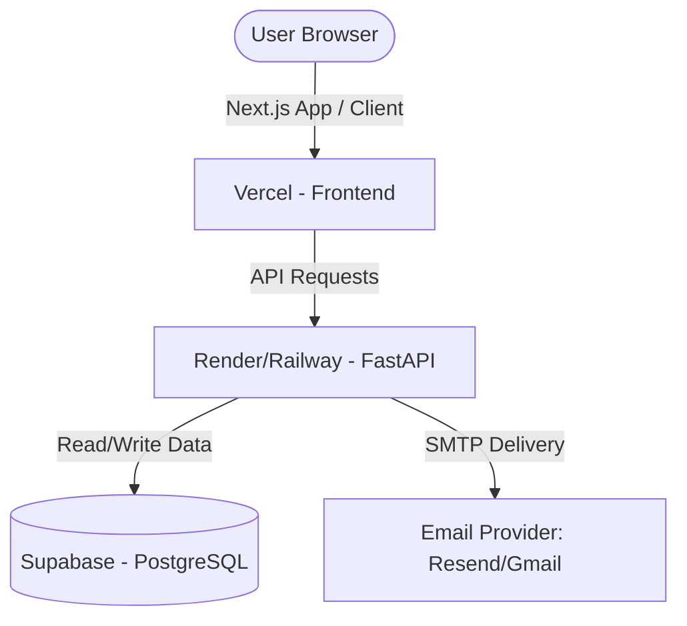

# Purrfect Match AI: Production Deployment Guide

This guide details the step-by-step process of deploying **Purrfect Match AI** to a production cloud environment, transitioning from a local SQLite database to a persistent PostgreSQL database, and hooking up real-world SMTP email services.

---

## Architecture Overview

---

## Step 1: Set up the Production Database (Supabase PostgreSQL)

Because SQLite is a local file database, deploying it in cloud containers (which are ephemeral and reset when they go idle) will cause your data to wipe on restarts. We will transition to a free, cloud-hosted **PostgreSQL** database.

1. Go to [Supabase](https://supabase.com/) and sign up for a free account.
2. Click **New Project** and select a database password.
3. Once the project is initialized, navigate to the **Database Settings** (Gear icon -> Database).
4. Copy the **URI Connection String** under "Connection String -> Transaction" (it starts with `postgresql://`).
5. Replace the password placeholder with your actual database password. This will be your `DATABASE_URL` environment variable.

---

## Step 2: Configure Real SMTP Email Services

To deliver real emails to users instead of writing mockup logs to `email_logs.txt`, choose an SMTP provider (e.g., **Gmail** or **Resend**).

### Option A: Gmail (Recommended for Hackathons)
1. Go to your Google Account settings $\rightarrow$ **Security**.
2. Enable **2-Step Verification**.
3. Search for **App Passwords** in the search bar.
4. Generate a new app password (select app: "Other", name: "Purrfect Match"). Copy the 16-character code.
5. Your email credentials will be:
   * `SMTP_HOST=smtp.gmail.com`
   * `SMTP_PORT=587`
   * `SMTP_USERNAME=yourgmail@gmail.com`
   * `SMTP_PASSWORD=your_16_character_app_password`
   * `SMTP_FROM_EMAIL=yourgmail@gmail.com`

### Option B: Resend (Recommended for Custom Domains)
1. Sign up for a free account at [Resend](https://resend.com/).
2. Generate an API Key under **API Keys**.
3. Verify a domain under **Domains** (or use the testing address).
4. Your email credentials will be:
   * `SMTP_HOST=smtp.resend.com`
   * `SMTP_PORT=587`
   * `SMTP_USERNAME=resend`
   * `SMTP_PASSWORD=re_your_api_key`
   * `SMTP_FROM_EMAIL=onboarding@resend.dev` (or your domain email)

---

## Step 3: Deploy the Backend (FastAPI on Render or Railway)

We will host the FastAPI app on **Render** (free tier) or **Railway** ($5 credit).

### Setup on Render
1. Go to [Render](https://render.com/) and log in with GitHub.
2. Click **New +** $\rightarrow$ **Web Service**.
3. Connect your `Purrfect-Match-AI` GitHub repository.
4. Configure the build parameters:
   * **Root Directory**: Leave blank (root `/` of the repository)
   * **Runtime**: `Python`
   * **Build Command**: `pip install -r backend/requirements.txt`
   * **Start Command**: `uvicorn backend.app.main:app --host 0.0.0.0 --port $PORT`
5. Click **Advanced** and add the following **Environment Variables**:
   * `DATABASE_URL`: *Your Supabase PostgreSQL connection URI*
   * `GEMINI_API_KEY`: *Your Gemini API Key (for behavior advice)*
   * `SMTP_HOST`: *Your SMTP server*
   * `SMTP_PORT`: `587`
   * `SMTP_USERNAME`: *Your SMTP username*
   * `SMTP_PASSWORD`: *Your SMTP password*
   * `SMTP_FROM_EMAIL`: *Your sender address*
   * `JWT_SECRET`: *Choose a random secure password string*
6. Click **Deploy Web Service**. Render will automatically compile the FastAPI code and expose a public URL (e.g. `https://purrfect-match-backend.onrender.com`).

---

## Step 4: Deploy the Frontend (Next.js on Vercel)

Vercel is the creator of Next.js and provides instant, zero-config compilation and hosting.

1. Go to [Vercel](https://vercel.com/) and sign up with GitHub.
2. Click **Add New** $\rightarrow$ **Project**.
3. Select your `Purrfect-Match-AI` repository.
4. Configure the project settings:
   * **Framework Preset**: `Next.js`
   * **Root Directory**: Select `frontend` (crucial so Vercel builds from the frontend sub-folder).
5. Open the **Environment Variables** accordion and add:
   * `NEXT_PUBLIC_API_URL`: *Your Render backend URL (e.g., `https://purrfect-match-backend.onrender.com`)*
6. Click **Deploy**. Vercel will build the static pages, compile the route modules, and deploy it to a live production domain (e.g. `https://purrfect-match-ai.vercel.app`).

---

## Feature Behavior: Local vs. Production

### Will there be changes in how features work?

Because of browser security policies and shifting from a local sandbox to HTTPS cloud hosting, some features will adapt:

| Feature | Local Behavior | Production Behavior | Action Required |
| :--- | :--- | :--- | :--- |
| **Webcam Media Capture** | Works on `http://localhost` automatically. | Requires **HTTPS** connection (enforced by Vercel out-of-the-box). | None. Vercel automatically secures your site with SSL so camera access works. |
| **Emails** | Writes mock HTML templates to `email_logs.txt`. | Sends real-world emails directly to adopters and shelters. | Ensure SMTP host environment variables are set correctly in Render/Railway. |
| **Chat history** | Persists in local browser storage (`localStorage`). | Persists in local browser storage (`localStorage`). | None. Keeps working exactly as it is now. |
| **CV / AI Diagnostics** | Calls frame contour analysis locally. | Analyzes files on Render servers. | None. Built-in Python utilities parse keyframe vectors inside Docker/Render without host dependencies. |
| **CORS Access Policy** | Open access. | Browsers enforce Cross-Origin Resource Sharing (CORS). | Our backend is configured to accept CORS requests dynamically, ensuring Vercel can fetch Render's API endpoints. |

---

## Step 5: Verification & Verification Checks

Once deployed, run these quick sanity checks:
1. Open the Vercel URL and sign up a new user. Verify that an email notification is sent to your inbox.
2. Log in and use the wiggling cat-eared chatbot. Verify that it plays the meow sound and loads/saves histories.
3. Open the **Behavior Hub**, click **Use Camera**, and capture an image. Check that it analyzes the cat mood and plays text-to-speech without device errors.
